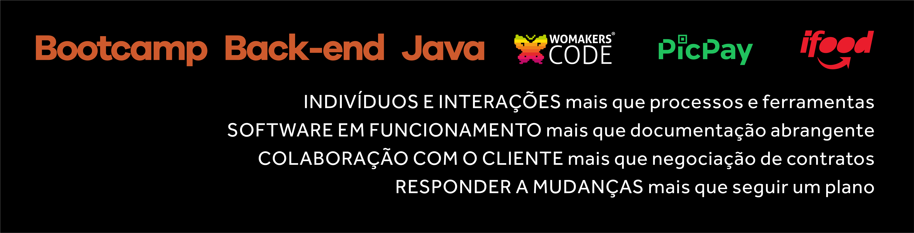

# Bootcamp de Java - REST API Star Wars
<h1 align="center">
    
</h1>

 No Bootcamp de Java da WomakersCode estamos trabalhando com a construção de microsserviços para aprimorar nossos conhecimentos na sua arquitetura e também em como podemos aplicar a metodologia do TDD para a criação do mesmo. 
 

## Índice

- [1. O que são microsserviços?](#1-microsserviços)
- [2. O que é TDD?](#2-tdd)
- [3. Tecnologias Usadas](#3-tecnologias)
- [4. Funcionalidades do microsserviço](#3-funcionalidades)
- [5. Checklist das tarefas solicitadas no Bootcamp](#3-checklist)
- [6. Referências](#3-referencias)

## 1. O que são microsserviços?
Os microsserviços (ou a arquitetura de microsserviços) consistem em uma abordagem arquitetônica nativa de cloud na qual um único aplicativo é composto de muitos componentes ou serviços menores que são implementáveis de forma independente e têm acoplamento fraco.

## 2. O que é TDD?
TDD é uma sigla para Test Driven Development, ou Desenvolvimento Orientado a Testes. A ideia do TDD é que você trabalhe em ciclos.

- Primeiro, escreva um teste unitário que inicialmente irá falhar, tendo em vista que o código ainda não foi implementado;

- Crie o código que satisfaça esse teste, ou seja: implemente a funcionalidade em questão. Essa primeira implementação deverá satisfazer imediatamente o teste que foi escrito no ciclo anterior;
 
- Quando o código estiver implementado e o teste satisfeito, refatore o código para melhorar pontos como legibilidade. Logo após, execute o teste novamente. A nova versão do código também deverá passar sem que seja necessário modificar o teste escrito inicialmente.

<h1 align="center">
    
</h1>

## 3. Tecnologias Usadas
- Java 11
- Maven
- Spring
- JPA
- TDD Test Driven Development

## 4. Funcionalidades do microsserviço

#### Criação de Jedi
- POST /jedi

#### Busca de Jedi por ID
- GET /jedi/{id}

#### Busca de todos os Jedis
- GET /jedis

#### Alteração de dados do Jedi
- PUT /jedi/{id}

#### Excluir Jedi
- DELETE /jedi/{id}

## 5. Checklist das tarefas solicitadas no Bootcamp

### JediServiceTest
- [x] Criar teste de erro NOT FOUND
- [x] Criar um teste pro findAll();

### JediControllerTest
- [x] Teste do PUT com sucesso
- [x] Teste do PUT com uma versao igual da ja existente - deve retornar um conflito
- [x] Teste do PUT com erro - not found
- [x] Teste do delete com sucesso
- [x] Teste do delete com erro - deletar um id ja deletado
- [x] Teste do delete com erro  - internal server error

## 6. Referências
- [O que são Microsserviços](https://www.ibm.com/br-pt/cloud/learn/microservices)
- [O que é TDD](https://www.treinaweb.com.br/blog/afinal-o-que-e-tdd)
- [Slide Ana Neri - REST API Star Wars](https://docs.google.com/presentation/d/13DAMAh-eu8GCftH2QeY4qPz9mjKN_KP-kuHxtvDvCSc/edit?usp=sharing
  )

